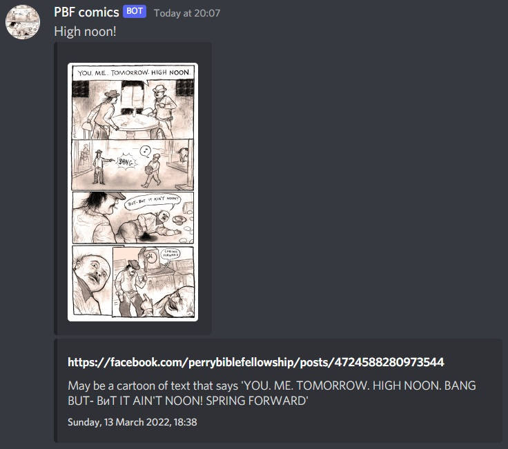

# notifier-bot

Parses webpages and notifies to a discord webhook.

#### Uses facebook-scraper on a single facebook page.
Call facebook.py to run, put it in a cron job. \
Parses the facebook_url in conf.json, saves post_ids in data.json. \
Call facebook.py arg1 arg2 to specify conf.json and data.json.

data.json:
```json
{
   "post_ids": []
}
```

conf.json:
```json
{
   "facebook_url":"",
   "discord_url":"",
   "id":"post_id",
   "username":"username",
   "avatar_url":"image_lowquality",
   "content":"text",
   "author":{
      "name":"link",
      "url":"link",
      "icon_url":""
   },
   "title":"",
   "url":"",
   "description":"",
   "thumbnail":{
      "url":""
   },
   "image":{
      "url":"images"
   },
   "footer":{
      "text":"timestamp",
      "icon_url":""
   }
}
```

Hardcoded parsed fields and generated webhook.

#### Uses feedparser on a rss feed.
Call rss.py to run, put it in a cron job. \
Parses the rss_url in conf.json, saves post_ids in data.json. \
Call rss.py arg1 arg2 to specify conf.json and data.json. \
Field true if entry or false if feed.

data.json:
```json
{
   "post_ids": []
}
```

conf.json:
```json
{
   "rss_url":"",
   "discord_url":"",
   "entries":"entries",
   "id":"id",
   "username":"feed.title",
   "avatar_url":"feed.image.href",
   "content":"title",
   "author":{
      "name":"author",
      "url":"link",
      "icon_url":""
   },
   "title":"",
   "url":"",
   "description":"",
   "thumbnail":{
      "url":""
   },
   "image":{
      "url":"summary"
   },
   "footer":{
      "text":"published_parsed",
      "icon_url":""
   },
   "e":{
      "username":false,
      "avatar_url":false,
      "content":true,
      "author":{
         "name":true,
         "url":true,
         "icon_url":false
      },
      "title":false,
      "url":false,
      "description":false,
      "thumbnail":{
         "url":false
      },
      "image":{
         "url":true
      },
      "footer":{
         "text":true,
         "icon_url":false
      }
   }
}
```

Examples:


